# Tabular — Schema ERD

Generated **2026-05-04T09:16:39+00:00** from `C:\Users\mbindl\Documents\GitHub\ParcelUpdate\db_connections\ConnectionFile_Tabular.sde`. arcpy 3.5.2.

**Counts:** 0 feature datasets · 0 feature classes · 132 tables · 0 relationship classes (0 in-workspace, 0 cross-workspace).

## Contents

- [Standalone feature classes & tables](#standalone)
- [Relationship overview](#relationship-overview)
- [Skipped objects](#skipped-objects)

## Standalone feature classes & tables <a id="standalone"></a>

### Standalone (1/3)

```mermaid
erDiagram
    Accela_Parcels {
        string APN
        string Parcel_Status
        float Owner_Number
        string Owner_Full_Name
        string Owner_Title
        string Owner_First_Name
        string Owner_Middle_Name
        string Owner_Last_Name
        string Owner_Address
        string Owner_City
        string Owner_State
        string Owner_Zip
        date REC_DATE
        string REC_FUL_NAM
        string Parcel_Address
        string Parcel_City
        string Parcel_State
        float Parcel_Zip
        float Parcel_Size
        string Jurisdiction
        string Local_Plan
        string Fire_District
        string HRA
        int OBJECTID PK
    }
    Accela_Record_Details {
        string APN
        string Accela_ID
        string Key_One
        int Key_Two
        string Key_Three
        string Short_Notes
        string Detailed_Description
        string Record_Status
        string Accela_CAPType_Name
        date File_Date
        string Assigned_To_Staff
        int OBJECTID PK
    }
    Accela_Record_Documents {
        int OBJECTID PK
        string Accela_CAPRecord_ID
        float Document_Sequence_Number
        string Document_Name
        string Document_Group
        string Document_Category
        string Document_Description
        date Upload_Date
        float File_Size
        string Original_File_Name
        string DOC_TYPE
        string VIEW_RESTRICT_ROLE
        string TITLE_RESTRICT_ROLE
        string VIEW_RESTRICT_ROLE_DOC
        string TITLE_RESTRICT_ROLE_DOC
        string VIEW_RESTRICT_ROLE_RDOC
        string TITLE_RESTRICT_ROLE_RDOC
        string RESTRICT_ROLE_RDOC
        string RESTRICT_DOC_TYP_FOR_ACA
    }
    Air_Quality {
        int OBJECTID PK
        string date
        string variable
        string id
        float value
    }
    Average_Daily_People {
        int OBJECTID PK
        int Year
        string Month
        int Daily_Persons
        guid GlobalID PK
        string created_user
        date created_date
        string last_edited_user
        date last_edited_date
    }
    bike_ped_counter_tabular {
        int OBJECTID PK
        string month_day_year
        string counter_name
        int month_of_year
        string season_of_year
        int count_of_bike_ped
        string counter_category
        string counter_id
        date count_date
    }
    BlockGroup_2020_ACS5yr_B01001_Age {
        int OBJECTID PK
        int TOTAL_POP
        int UNDER_18
        int F18_24
        int F25_34
        int F35_44
        int F45_54
        int F55_64
        int F65_74
        int OVER_75
        int TOTAL_MALE
        int M_UNDER5
        int M_5_9
        int M_10_14
        int M_15_17
        int M_18_19
        int M_20
        int M_21
        int M_22_24
        int M_25_29
        int M_30_34
        int M_35_39
        int M_40_44
        int M_45_49
        int M_50_54
        int M_55_59
        int M_60_61
        int M_62_64
        int M_65_66
        int M_67_69
        int M_70_74
        int M_75_79
        int M_80_84
        int M_OVER85
        int TOTAL_FEMALE
        int F_UNDER5
        int F_5_9
        int F_10_14
        int F_15_17
        int F_18_19
        %% +21 more fields
    }
    BlockGroup_2020_ACS5yr_B03002_Race {
        int OBJECTID PK
        int TOTAL_POP
        int WHITE
        int BLACK
        int NATIVE
        int ASIAN
        int PACIFIC_ISLANDER
        int OTHER
        int TWO_MORE
        int NOT_HISPANIC
        int HISPANIC
        string GEOID
        float BLKGRPID
        string BLOCK_GROUP
    }
    BlockGroup_2020_ACS5yr_B16004_Language {
        int OBJECTID PK
        int TOTAL_POP
        int ENGLISH_VERY_WELL
        int ENGLISH_WELL
        int ENGLISH_NOT_WELL
        int NO_ENGLISH
        string GEOID
        float BLKGRPID
        string BLOCK_GROUP
    }
    BlockGroup_2020_ACS5yr_B17021_BelowPovertyLine {
        int OBJECTID PK
        int TOTAL_POP
        int BELOW_POVERTY
        int BELOW_POV_HH
        int ABOVE_POVERTY
        int ABOVE_POV_HH
        string GEOID
        float BLKGRPID
        string BLOCK_GROUP
    }
    BlockGroup_2020_ACS5yr_B22010_HouseholdDisability {
        int OBJECTID PK
        int TOTAL_HH
        int HH_DISABILITY
        int SNAP_HH
        int SNAP_HH_DISABILITY
        int HH_DISABILITY_1
        string GEOID
        float BLKGRPID
        string BLOCK_GROUP
    }
    BlockGroup_2020_ACS5yr_B23024_IndividualDisability {
        int OBJECTID PK
        int TOTAL_POP
        int TOTAL_DISABILITY
        int NO_DISABILITY
        string GEOID
        float BLKGRPID
        string BLOCK_GROUP
    }
    BlockGroup_2020_ACS5yr_B25044_ZeroVehicleHouseholds {
        int OBJECTID PK
        int TOTAL_HH
        int ZVH_TOTAL
        int TOTAL_OWNER
        int ZVH_OWNER
        int OWNER_1CAR
        int OWNER_2CARS
        int OWNER_3CARS
        int OWNER_4CARS
        int OWNER_5CARS
        int TOTAL_RENTER
        int ZVH_RENTER
        int RENTER_1CAR
        int RENTER_2CARS
        int RENTER_3CARS
        int RENTER_4CARS
        int RENTER_5CARS
        string GEOID
        float BLKGRPID
        string BLOCK_GROUP
    }
    Campground_Visitation {
        int OBJECTID PK
        string Campground
        string Month
        int Year
        string Land_Owner
        int Total_Sites
        int Sites_Sold
        int Visitation_Total
        float Occupancy_Rate
        string Observed_Estimate
        string Data_Source
        string Notes
    }
    ClimateResilience_CentralSierraSnowLab_AllData {
        int OBJECTID PK
        float Air_Temp_Max_C
        float Air_Temp_Min_C
        float Full_Day_Total_Precip_mm
        float Season_Total_Precip_mm
        string Pct_of_Precip_as_Snow
        string Pct_of_Precip_as_Rain
        float New_Snow_cm
        float Season_Total_Snow_cm
        float Snowpack_depth_cm
        float Snow_Water_Equivalent_cm
        string Remarks
        int Month
        int Year
        string Month_Year
        date Day
        string created_user
        date created_date
        string last_edited_user
        date last_edited_date
    }
    ClimateResilience_COSTAR_LakeTahoe_MF_AllBeds {
        int OBJECTID PK
        string Period
        int Inventory_Bldgs
        int Inventory_Units
        int Inventory_Avg_SF
        float Asking_Rent_Per_Unit
        float Asking_Rent_Per_SF
        string Asking_Rent___Growth_Yr
        float Effective_Rent_Per_Unit
        float Effective_Rent_Per_SF
        string Effective_Rent___Growth_Yr
        string Effective_Rent_Concessions__
        int Vacancy_Units
        string Vacancy_Percent
        string Vacancy___Growth_Yr
        float Occupancy_Units
        string Occupancy_Percent
        string Occupancy___Growth_Yr
        string Absorption_Units
        string Absorption_Percent
        int Under_Construction_Bldgs
        int Under_Construction_Units
        string Under_Construction_Percent
        int Deliveries_Bldgs
        int Deliveries_Units
        string Deliveries_Percent
        string created_user
        date created_date
        string last_edited_user
        date last_edited_date
    }
    ClimateResilience_DeedRestrictedHousingUnits {
        int OBJECTID PK
        guid GlobalID PK
        string File_Number
        string APN
        string Deed_Restriction_Type
        int Units
        string Date_Type
        string LTinfo_Transaction_ID
        string LTInfo_Deed_Restriction
        string DR_Desc
        string Center
        string Notes
        date Issued_Date
        date Acknowledged_Date
        date Pre_Grade_Date
        date Finaled_Date
        string_100 APO_ADDRESS
        string_25 PSTL_TOWN
        string_2 PSTL_STATE
        string_5 PSTL_ZIP5
        string OWN_FIRST
        string OWN_LAST
        string OWN_FULL
        string_100 MAIL_ADD1
        string_100 MAIL_ADD2
        string_50 MAIL_CITY
        string_2 MAIL_STATE
        string_5 MAIL_ZIP5
        string_4 JURISDICTION
        string_2 COUNTY
        string_12 OWNERSHIP_TYPE
        string_4 COUNTY_LANDUSE_CODE
        string COUNTY_LANDUSE_DESCRIPTION
        string_50 EXISTING_LANDUSE
        string_8 PLAN_ID
        string_40 PLAN_NAME
        string_50 ZONING_ID
        string ZONING_DESCRIPTION
        string_50 TOWN_CENTER
        string_50 LOCATION_TO_TOWNCENTER
        %% +14 more fields
    }
    ClimateResilience_EnergyMix {
        int OBJECTID PK
        string Source
        int Year
        string Type
        float Share
        string created_user
        date created_date
        string last_edited_user
        date last_edited_date
    }
    ClimateResilience_Impervious_Identify_Areawide_ByYear {
        int OBJECTID PK
        int FID_Impervious_2019
        string_8 Feature
        string_4 Surface
        int FID_Existing_Drainage_Areas
        string_100 Drainage_Area_Name
        string_50 Status
        string_4 Year_Completed
        float Acres
        string created_user
        date created_date
        string last_edited_user
        date last_edited_date
    }
    ClimateResilience_LODES_OriginDestination {
        int OBJECTID PK
        float w_geocode
        float h_geocode
        int S000
        int SA01
        int SA02
        int SA03
        int SE01
        int SE02
        int SE03
        int SI01
        int SI02
        int SI03
        int createdate
        int Year
        string work_in_basin
        string home_in_basin
        string category
        string h_tract_TRPAID
        string w_tract_TRPAID
        string h_block_TRPAID
        string w_block_TRPAID
        float h_block_lat
        float h_block_long
        float w_block_lat
        float w_block_long
        float h_tract_lat
        float h_tract_long
        float w_tract_lat
        float w_tract_long
        string w_tract_id
        string h_tract_id
        string created_user
        date created_date
        string last_edited_user
        date last_edited_date
    }
    ClimateResilience_LODES_WorkLocations {
        int OBJECTID PK
        float w_geocode
        int C000
        int CA01
        int CA02
        int CA03
        int CE01
        int CE02
        int CE03
        int CNS01
        int CNS02
        int CNS03
        int CNS04
        int CNS05
        int CNS06
        int CNS07
        int CNS08
        int CNS09
        int CNS10
        int CNS11
        int CNS12
        int CNS13
        int CNS14
        int CNS15
        int CNS16
        int CNS17
        int CNS18
        int CNS19
        int CNS20
        int CR01
        int CR02
        int CR03
        int CR04
        int CR05
        int CR07
        int CT01
        int CT02
        int CD01
        int CD02
        int CD03
        %% +23 more fields
    }
    ClimateResilience_ModeShare {
        int OBJECTID PK
        string Source
        int Year
        string Season
        string Day
        float Number
        string Mode
        string Field7
        string Field8
        string Field9
        string Field10
        string Field11
        string Field12
        string Field13
        string Field14
        string Field15
        guid GlobalID PK
        string created_user
        date created_date
        string last_edited_user
        date last_edited_date
    }
    ClimateResilience_ProbabilityHighSeverityFire_by_ForestManagmentZone {
        int OBJECTID PK
        int FID_ForestManagementZone_USFS
        string Name
        float Acres
        int FID_FunctionalFire_ProbableHigh
        int Id
        int gridcode
        float Shape_Length
        float Shape_Area
        string Category
        string created_user
        date created_date
        string last_edited_user
        date last_edited_date
    }
    ClimateResilience_ProbabilityLowSeverityFire_by_ForestManagmentZone {
        int OBJECTID PK
        int FID_ForestManagementZone_USFS
        string Name
        float Acres
        string created_user
        date created_date
        string last_edited_user
        date last_edited_date
        int FID_FunctionalFire_ProbableLowS
        int Id
        int gridcode
        float Shape_Length
        float Shape_Area
    }
    ClimateResilience_PropertyRadar {
        int OBJECTID PK
        int year
        int month
        float Purchase_Amt
        string month_year
        string created_user
        date created_date
        string last_edited_user
        date last_edited_date
    }
    ClimateResilience_PurpleAir {
        int OBJECTID PK
        int sensor_index
        float pm25_a
        float pm25_b
        string one_channel_offline
        string both_channel_offline
        string abs_test_pass
        string sd_test_pass
        string reliable
        float mean_pm25
        date date
        string created_user
        date created_date
        string last_edited_user
        date last_edited_date
    }
    ClimateResilience_TOT {
        int OBJECTID PK
        string Jurisdiction
        string Duration
        string Quarter
        string Fiscal_Year
        int Year
        float TOT_Collected
        string created_user
        date created_date
        string last_edited_user
        date last_edited_date
    }
    ClimateResilience_Transit_Monthly_Ridership_by_Route {
        int OBJECTID PK
        string MONTH
        int TTD_Fixed_Route
        int TTD_Paratransit
        int TART_Fixed_Route
        int TART_Paratransit
        int TART_Connect
        int Lake_Link
        int Total
        string created_user
        date created_date
        string last_edited_user
        date last_edited_date
    }
    ClimateResilienceDashboard_CensusData {
        int OBJECTID PK
        string variable_code
        string variable_name
        int value
        string Geography
        int year_sample
        string dataset
        string sample_level
        string Category
        string created_user
        date created_date
        string last_edited_user
        date last_edited_date
    }
    Congestion {
        int OBJECTID PK
        float id
        float congestion_index
        string date
    }
    EffectivePopulationModel {
        int OBJECTID PK
        string Variable
        float Value
        int Year
    }
    ExistingDevelopment {
        int OBJECTID PK
        string_30 APN
        string_8 JURISDICTION
        string_4 COUNTY
        string COUNTY_LANDUSE_DESCRIPTION
        string_50 TRAP_LANDUSE_DESCRIPTION
        string ZONING_DESCRIPTION
        string_74 PLAN_NAME
        string_68 TOWN_CENTER
        string_38 LOCATION_TO_TOWNCENTER
        float RES_2018
        float TAU_2018
        float CFA_2018
        float RES_2019
        float TAU_2019
        float CFA_2019
        float RES_2020
        float TAU_2020
        float CFA_2020
    }
    GEN_TRAN_DETAIL {
        int OBJECTID PK
        float GEN_SOURCE
        float GEN_TRAN_ID
        string OBJECT_TYPE
        date GEN_TRAN_DATE
        string GEN_TRAN_DESC
        string GEN_ACTION_BY
        date REC_DATE
        string REC_FUL_NAM
        string REC_STATUS
        string GEN_TRAN_ACTION_NBR
    }
    GENEALOGY {
        int OBJECTID PK
        float GEN_SOURCE
        float GEN_SEQ_NBR
        float GEN_TRAN_ID
        string OBJECT_TYPE
        string OBJECT_NBR
        float GEN_STAGE_NBR
        date REC_DATE
        string REC_FUL_NAM
        string REC_STATUS
    }
    GHG_Emissions_Summary {
        int OBJECTID PK
        string Category
        string Sector
        int Year
        int MT_CO2
        float Percent_of_Year
        guid GlobalID PK
        string created_user
        date created_date
        string last_edited_user
        date last_edited_date
    }
    Housing {
        int OBJECTID PK
        string Variable
        string Geography
        float Value
        int Year
        string Source
    }
    LandUseCode {
        int OBJECTID PK
        string County_Description
        string TRPA_Description
        string County
        string_5 CountyCode
    }
    Layer_Stats {
        int OBJECTID PK
        string Layer_Name
        string Layer_Alias
        int Feature_Count
        date LastUpdated
    }
    limebike_pilot_2017 {
        int OBJECTID PK
        int user_id
        int trip_id
        string status
        string started_at
        string completed_at
        float start_latitude
        float start_longitude
        string end_latitude
        string end_longitude
        int distance_meters
        string note
    }
    LocalPlan_URL {
        int OBJECTID PK
        string_4 PLAN_ID
        string_40 PLAN_NAME
        string File_URL
    }
    Mooring_Permit_History {
        int OBJECTID PK
        string APN
        string Address
        string Owner
        string Lease_Permit_APN
        string Lease_Number_Permit_ID
        string Grantee_Lessee_Name
        string Description
        date Lease_Permit_Start
        date Lease_Permit_Expires
        string_100 Record_County
        string_25 Source
    }
    Moorings_withLottery {
        int OBJECTID PK
        string Source
        string APNs
        string Mooring_Registration_Submission
        string Registration_Status
    }
    Nearshore_NTU {
        int OBJECTID PK
        string Location
        float NTU2015
        float NTU2016
        float NTU2017
        float NTU2018
        float NTU2019
        float NTU2020
        float NTU2021
        float NTU2022
        float NTU2023
    }
    NRCS_2007_Soil_Survey {
        int OBJECTID PK
        string_50 MUSYM
        float KSAT
        float DEPTH
        float WATER_TABLE
        float BEDROCK
        string BEDROCK_DESCRIPTION
        string_50 SOIL_CONSTRAINT
        string SOIL_REASON
        float Shape_Length
        float Shape_Area
    }
    Occupancy_Rates {
        int OBJECTID PK
        string Jurisdiction
        string ZoneName
        string ZoneID
        string AreaName
        float Year
        string Month
        string Quarter
        float MonthNum
        string QuarterNum
        string Type
        string Category
        float RoomsAvailable
        float RoomsRented
        float OccupancyRate
        string AverageRate
        string Source
        guid GlobalID PK
        string created_user
        date created_date
        string last_edited_user
        date last_edited_date
    }
    Parcel_Address {
        int OBJECTID PK
        string_16 APN
        float PPNO
        string_4 JURISDICTION
        int HSE_NUMBR
        string_12 UNIT_NUMBR
        string_2 STR_DIR
        string_100 STR_NAME
        string_6 STR_SUFFIX
        string_100 APO_ADDRESS
        string_25 PSTL_TOWN
        string_2 PSTL_STATE
        string_5 PSTL_ZIP5
    }
    Parcel_APN_NewOld {
        int OBJECTID PK
        string APN
        string Status
        date DiscoveryDate
        int TRPA_Boundary
    }
    Parcel_APN_NewOld {
        int OBJECTID PK
        string APN
        string Status
        date DiscoveryDate
        int TRPA_Boundary
    }
    Parcel_County_Staging {
        int OBJECTID PK
        string_50 APN
        float PPNO
        string_4 JURISDICTION
        string_2 COUNTY
        string_25 HSE_NUMBR
        string_50 UNIT_NUMBR
        string_5 STR_DIR
        string_100 STR_NAME
        string_6 STR_SUFFIX
        string_100 APO_ADDRESS
        string_25 PSTL_TOWN
        string_2 PSTL_STATE
        string_5 PSTL_ZIP5
        string OWN_FIRST
        string OWN_LAST
        string OWN_FULL
        string_100 MAIL_ADD1
        string_50 MAIL_CITY
        string_2 MAIL_STATE
        string_5 MAIL_ZIP5
        int AS_LANDVALUE
        int AS_IMPROVALUE
        int AS_SUM
        int TAX_LANDVALUE
        int TAX_IMPROVALUE
        int TAX_SUM
        string_5 TAX_YEAR
        string_50 COUNTY_LANDUSE_CODE
        string COUNTY_LANDUSE
        int YEAR_BUILT
        float UNITS
        float BEDROOMS
        float BATHROOMS
        float BUILDING_SQFT
        string_3 VHR
        string_3 HOA
        string_50 OWNERSHIP_TYPE
        string_50 EXISTING_LANDUSE
        string_50 REGIONAL_LANDUSE
        %% +33 more fields
    }
    Parcel_Owner {
        int OBJECTID PK
        string_16 APN
        float PPNO
        string_4 JURISDICTION
        string_50 OWN_FIRST
        string_100 OWN_LAST
        string_100 OWN_FULL
        string_100 MAIL_ADD1
        string_100 MAIL_ADD2
        string_50 MAIL_CITY
        string_2 MAIL_STATE
        string_5 MAIL_ZIP5
    }
    Parcel_Researched_Retired {
        int OBJECTID PK
        string_16 APN
        string_50 SOURCE
        date DATE_ADDED
        string_50 Status
    }
    Parcel_Value {
        int OBJECTID PK
        string_16 APN
        float PPNO
        int HSE_NUMBR
        string_12 UNIT_NUMBR
        string_2 STR_DIR
        string_100 STR_NAME
        string_6 STR_SUFFIX
        string_100 APO_ADDRESS
        string_25 PSTL_TOWN
        string_2 PSTL_STATE
        string_5 PSTL_ZIP5
        string_50 OWN_FIRST
        string_100 OWN_LAST
        string_100 OWN_FULL
        string_100 MAIL_ADD1
        string_100 MAIL_ADD2
        string_50 MAIL_CITY
        string_2 MAIL_STATE
        string_5 MAIL_ZIP5
        string_4 JURISDICTION
        string_2 COUNTY
        string_12 OWNERSHIP_TYPE
        string_4 COUNTY_LANDUSE_CODE
        string COUNTY_LANDUSE_DESCRIPTION
        string_50 TRPA_LANDUSE_DESCRIPTION
        string_50 REGIONAL_LANDUSE
        string_5 UNITS
        string_5 BEDROOMS
        string_5 BATHROOMS
        float ALLOWABLE_COVERAGE_BAILEY_SQFT
        float IMPERVIOUS_SURFACE_SQFT
        string_5 SOIL_1974
        string_5 SOIL_2003
        string_30 HRA_NAME
        int WATERSHED_NUMBER
        string_30 WATERSHED_NAME
        string_2 PRIORITY_WATERSHED
        string_25 FIREPD
        int WITHIN_TRPA_BNDY
        %% +22 more fields
    }
    Periphyton {
        int OBJECTID PK
        string id
        string Date
        float value
        string unit
    }
    PermissibleUses {
        int OBJECTID PK
        string Zoning_ID
        string Category
        string Subcategory
        string Use_Type
        string Use_Status
        int Density
        string Unit
        string Notes
    }
    Scenic_Corridor {
        int OBJECTID PK
        string corridor_name
        string JURD_
        float UNIT
        float YEAR
        float MAN_MADE_FEATURES
        float ROADWAY_DISTRACTIONS
        float ROAD_STRUCTURE
        float LAKE_VIEWS
        float LANDSCAPE_VIEWS
        float VARIETY
        string STATUS
        string category
        string id
        float THRESHOLD_RATING
    }
    Scenic_Viewpoint_OLD {
        int OBJECTID PK
        string corridor_name
        string JURD_
        float UNIT
        float SCENIC_RESOURCES
        string VIEW_TYPES
        float YEAR
        float UNITY
        float VIVIDNESS
        float VARIETY
        float INTACTNESS
        float THRESHOLD_RATING
        string THRESHOLD_STATUS
        string category
        string id
    }
    School_Enrollment {
        int OBJECTID PK
        string School_Name
        string State
        string Level_
        string Year
        float Enrollment
        string data_source
        int school_id
    }
    secchi_full_dataset {
        int OBJECTID PK
        date date
        float secchi_average_measurement
    }
    secchi_measurements {
        int OBJECTID PK
        int year_measurement
        string season
        float measurement_meters
        string source
    }
    secchi_summarized {
        int OBJECTID PK
        int year
        float annual_average
        float winter_average
        float summer_average
        float F5_year_average
        float predicted
        guid GlobalID PK
        string created_user
        date created_date
        string last_edited_user
        date last_edited_date
    }
```

### Standalone (2/3)

```mermaid
erDiagram
    StateLands {
        int OBJECTID PK
        string APN
        float RECORD_ID
        string Source
        string LESSEE_GRANTEE
        string Description
        string OLD_PARCEL
        date START_DATE
        date END_DATE
        string COUNTY
        string ON_LATEST_STATE_REPORTS
        date TRPA_LAST_UPDATED_DATE
        string UPDATE_NOTES
    }
    Tables_with_Descriptions {
        int OBJECTID PK
        string Feature_Class_Name
        string Descriptions
        string Notes
        string_50 sAddBy
        string_50 sModBy
        date dAddDate
        date dModDate
    }
    tahoe_yellow_cress_surveys {
        int OBJECTID PK
        string site_owner
        int year_of_count
        string cress_count
        string site_name
    }
    TBLFish_Habitat {
        int OBJECTID PK
        int HABITAT
        string_50 DESCRIPTION
    }
    TEMP_TABLE {
        int ROWID
        string TableName
        string ColName
        string ColType
    }
    ThresholdEvaluation_AirQuality {
        int OBJECTID PK
        string Indicator
        string Pollutant
        string Statistic
        int Year
        string Data
        string Site
        float Value
        string Data_Source
        int Exceedances
        string Threshold_Value
        string Percent_of_Threshold_Value
        string Include_in_Trend_Analysis
    }
    ThresholdEvaluation_CumulativeAccounting_Allocations {
        int OBJECTID PK
        string Jurisdiction
        int Year
        int Value
        string Status
    }
    ThresholdEvaluation_CumulativeAccounting_Applications {
        int OBJECTID PK
        string Type
        int Year
        int Value
    }
    ThresholdEvaluation_CumulativeAccounting_BankedDevelopment {
        int OBJECTID PK
        string Development_Right
        int Total_Banked
        int Stream_Environment_Zones
        int Remote_Areas
        int Year
        string Reported
    }
    ThresholdEvaluation_CumulativeAccounting_CapitalExpenditures {
        int OBJECTID PK
        string TRPATrustFundAccount_
        int BeginningBalance
        int ContributionsInterest
        int Expenditures_A
        int EndingBalance_2019
    }
    ThresholdEvaluation_CumulativeAccounting_CFA_Accounting {
        int OBJECTID PK
        string Jurisdiction
        int Existing_CFA
        int Banked_CFAB
        int Remaining_1987_2012_Allocation
    }
    ThresholdEvaluation_CumulativeAccounting_CFA_Allocations {
        int OBJECTID PK
        string Jurisdiction
        int Year
        int Value
        string Field4
        string Field5
        string Field6
    }
    ThresholdEvaluation_CumulativeAccounting_CFA_By_Area {
        int OBJECTID PK
        string Jurisdiction
        int Total_Existing_CFA1
        int TownCenter
        int Within_QuarterMile_TownCenter
        int RemoteArea
    }
    ThresholdEvaluation_CumulativeAccounting_CFA_By_Year {
        int OBJECTID PK
        string Jurisdiction
        int Year
        int Value
        string Field4
        string Field5
        string Field6
    }
    ThresholdEvaluation_CumulativeAccounting_CodeCompliance {
        int OBJECTID PK
        string Type
        int Year
        int Value
    }
    ThresholdEvaluation_CumulativeAccounting_DevelopmentTypeLandCapLandUseByJurisdiction {
        int OBJECTID PK
        string Jurisdiction
        string Development_Type
        int Non_Sensitive
        int SEZ
        int Sensitive
        int Remote_Areas
        int Within_Quarter_Mile_of_Town_Cen
        int Town_Centers
        int Total_Existing
    }
    ThresholdEvaluation_CumulativeAccounting_NewCoverageByEvaluationPeriod {
        int OBJECTID PK
        string Jurisdiction
        float Acres_1991_1995
        float Acres_1996_2000
        float Acres_2001_2005
        float Acres_2006_2010
        float Acres_2011_2015
        float Acres_2016_2019
    }
    ThresholdEvaluation_CumulativeAccounting_PAOTAllocations {
        int OBJECTID PK
        string PAOT_Categories
        int Regional_Plan_Allocations
        int Assigned_2015_Evaluation
        int Assigned_2015_2019
        int PAOTs_Remaining
        float Percent_PAOTs_Assigned
    }
    ThresholdEvaluation_CumulativeAccounting_ProjectMitigation {
        int OBJECTID PK
        string ExpendituresObligations
        float AirQualityMitigation
        float WaterQualityMitigation
        float StreamZoneRestorationProgram
        float OperationsMaintenance
        int ExcessOffsiteLandCoverageMitiga
    }
    ThresholdEvaluation_CumulativeAccounting_Recreation_PAOT {
        int OBJECTID PK
        int Year
        int Value
    }
    ThresholdEvaluation_CumulativeAccounting_RentalCarMitigationFee {
        int OBJECTID PK
        string Type
        int Year
        float Value
    }
    ThresholdEvaluation_CumulativeAccounting_ResidentialUnitSummary {
        int OBJECTID PK
        string Jurisdiction
        int EstimatedExisting
        int BankedExisting
        int RemainingAllocations_ReleasedLo
        int RemainingAllocations_Unreleased
        int ResidentialBonusUnits
        int TotalDevelopmentPotential
        int Year
        string Reported
    }
    ThresholdEvaluation_CumulativeAccounting_SewerCapacity {
        int OBJECTID PK
        string SewerDistrict
        float PeakSewerFlow
        float Average2019_PeakSewerFlow
        float Capacity1
        float ReserveCapacity_from2019Peak
    }
    ThresholdEvaluation_CumulativeAccounting_TAU {
        int OBJECTID PK
        string Jurisdiction
        int TotalExistingTAUs_A
        int BankedReceivedTAUs_B
        int Remaining_1987Plan_2012Allocati
    }
    ThresholdEvaluation_CumulativeAccounting_TAU_By_Area {
        int OBJECTID PK
        string Jurisdiction
        int TotalExistingTAU
        int TownCenter
        int WithinQuarterMile_TownCenter
        int RemoteArea
    }
    ThresholdEvaluation_CumulativeAccounting_Trips {
        int OBJECTID PK
        string Jurisdiction
        int Year
        string Type
        int Value
    }
    ThresholdEvaluation_CumulativeAccounting_UnitSummary {
        int OBJECTID PK
        string Type
        int Existing
        int Banked
        int Remaining
        int Year
        string Reported
    }
    ThresholdEvaluation_ExistingDevelopmentRights_By_LandCapability {
        int OBJECTID PK
        int Field1
        float ID
        int Join_Count
        string APN
        float PPNO
        float PARCEL_ACRES
        float PARCEL_SQFT
        string JURISDICTION
        string PLAN_NAME
        string LOCATION_TO_TOWNCENTER
        float RES_2018
        float TAU_2018
        float CFA_2018
        float RES_2019
        float TAU_2019
        float CFA_2019
        string LandCapabilityClass
        string AllLandCapabilities
        string CentroidLandCapability
        string MajorityLandCapability
        string MinorityLandCapability
        float MajorityPercent
        string LandCapabilityType
        string LandCapabilityType_NRCS
        string MajorityLandCapability_NRCS
        string MinorityLandCapability_NRCS
        float MajorityPercent_NRCS
    }
    ThresholdEvaluation_Indicator_StatusTrendConfidence {
        int OBJECTID PK
        int IndicatorID
        string ThresholdCategory
        string ThresholdReportingCategory
        string IndicatorName
        string Status2011
        string Trend2011
        string Confidence2011
        string Status2015
        string Trend2015
        string Confidence2015
        string Status2019
        string Trend2019
        string Confidence2019
        string Status2023
        string Trend2023
        string Confidence2023
    }
    ThresholdEvaluation_LoadReduction_FineSediment {
        int OBJECTID PK
        float Water_Year
        float Percentage_Load_Reduction
        float Target_Percent
    }
    ThresholdEvaluation_LoadReduction_Nitrogen {
        int OBJECTID PK
        float Water_Year
        float Percentage_Load_Reduction
        float Target_Percent
    }
    ThresholdEvaluation_LoadReduction_Phosphorous {
        int OBJECTID PK
        float Water_Year
        float Percentage_Load_Reduction
        float Target_Percent
    }
    ThresholdEvaluation_MidLake_DissolvedNitrogen {
        int OBJECTID PK
        int Year
        float Value
    }
    ThresholdEvaluation_NOX_Emissions {
        int OBJECTID PK
        int Year
        float Value
        float Threshold
    }
    ThresholdEvaluation_Periphyton {
        int OBJECTID PK
        string Site
        date Date
        float Depth_m
        string Chla_mg_m2
        float LOI_g_m2
        string AFDW_g_m2
        string Above_Visual_Score
        string Below_Visual_Score
        string Algal_Fil__Lnth__cm_
        string Algal_Coverage__
        string Biomass_Index_PBI
        float LakeSurfaceElevation_Ft
        float Elevation_Sampled_Ft
        date Date_Last_Exposed_at_surface
        string DaysSinceLastExposed
        string YearsSinceLastExposed
        int CY
        int SD
        int FG
        string Region
        string WY_Max
        int WaterYear
    }
    ThresholdEvaluation_PlanAreaNoise {
        int OBJECTID PK
        int OID_
        string Category
        string Description
        string Year
        float Value
        float Threshold_Value
    }
    ThresholdEvaluation_PrimaryProductivity {
        int OBJECTID PK
        int Year
        float Primary_Productivity
        string Notes
    }
    ThresholdEvaluation_SEZEnhancedRestored {
        int OBJECTID PK
        int Year
        float Enhanced
        float Restored
        float Total
        string created_user
        date created_date
        string last_edited_user
        date last_edited_date
    }
    ThresholdEvaluation_SEZRestoration {
        int OBJECTID PK
        string ProjectName
        int YearCompleted
        float AcresRestored
        string created_user
        date created_date
        string last_edited_user
        date last_edited_date
    }
    ThresholdEvaluation_ShoreNoise {
        int OBJECTID PK
        string Category
        float Year
        float Value
        float Threshold_Value
    }
    ThresholdEvaluation_SoilConservation_ImperviousOverlayAnalysis_2010 {
        int OBJECTID PK
        int OBJECTID_1
        int FID_id_NRCS_Impe
        int FID_id_NRCS_Im_1
        int FID_id_NRCS_Im_2
        int FID_land_capabil
        string MUSYM
        int MUKEY
        float sde_SDE_land_cap
        float Map_Symbol
        string Land_Capab
        float Percent_Al
        float Bailey_Co
        float Allowed_ac
        float GISAcre
        int FID_Impervious_2
        string Feature
        string Surface
        float Shape_STArea_1
        float Shape_STLength_1
        int FID_LocalPlan
        string PLAN_NAME
        string PLAN_TYPE
        string JURISDICTION
        float GIS_ACRES
        float SQFT
        string PLAN_ID
        float Shape_STArea_12
        float Shape_STLength_2
        int FID_TownCenter
        string Name
        int District_Number
        string Description
        string Land_Use
        string Jurisdiction_1
        string id
        int CNEL
        string Transect
        float Acres
        float Shape_STArea_12_
        %% +56 more fields
    }
    ThresholdEvaluation_SoilConservation_ImperviousOverlayAnalysis_2010_Original {
        int OBJECTID PK
        int OBJECTID_1
        int FID_id_NRCS_Impe
        int FID_id_NRCS_Im_1
        int FID_id_NRCS_Im_2
        int FID_land_capabil
        string MUSYM
        int MUKEY
        float sde_SDE_land_cap
        float Map_Symbol
        string Land_Capab
        float Percent_Al
        float Bailey_Co
        float Allowed_ac
        float GISAcre
        int FID_Impervious_2
        int FType
        int SType
        float SqFt
        float Shape_STArea_1
        float Shape_STLength_1
        int FID_LocalPlan
        string PLAN_NAME
        string PLAN_TYPE
        string JURISDICTION
        float GIS_ACRES
        float SQFT_1
        string PLAN_ID
        float Shape_STArea_12
        float Shape_STLength_2
        int FID_TownCenter
        string Name
        int District_Number
        string Description
        string Land_Use
        string Jurisdiction_1
        string id
        int CNEL
        string Transect
        float Acres
        %% +37 more fields
    }
    ThresholdEvaluation_SoilConservation_ImperviousOverlayAnalysis_2019 {
        int OBJECTID PK
        int OBJECTID_1
        int FID_id_NRC
        int FID_id_N_1
        int FID_id_N_2
        int FID_land_c
        string MUSYM
        int MUKEY
        float sde_SDE_la
        float Map_Symbol
        string Land_Capab
        float Percent_Al
        float Bailey_Co
        float Allowed_ac
        float GISAcre
        int FID_Imperv
        string Feature
        string Surface
        float Shape_STAr
        float Shape_STLe
        int FID_LocalP
        string PLAN_NAME
        string PLAN_TYPE
        string JURISDICTI
        float GIS_ACRES
        float SQFT
        string PLAN_ID
        float Shape_ST_1
        float Shape_ST_2
        int FID_TownCe
        string Name
        int District_N
        string Descriptio
        string Land_Use
        string Jurisdic_1
        string id
        int CNEL
        string Transect
        float Acres
        float Shape_ST_3
        %% +59 more fields
    }
    ThresholdEvaluation_SoilConservation_ImperviousOverlayAnalysis_Change {
        int OBJECTID PK
        int OBJECTID_1
        int FID_id_NRC
        int FID_id_N_1
        int FID_id_N_2
        int FID_Land_C
        int FID_land_1
        string LandCapabi
        float GISAcre1
        int FID_Parcel
        string Status
        float IPESScore
        string IPESScoreT
        float RelativeEr
        float RunoffPote
        int FID_Land_2
        string LandCapa_1
        float GISAcre
        string IPES_Trans
        string Land_Capab
        int FID_Imperv
        int FID_Impe_1
        string Feature
        string Surface
        int FID_Impe_2
        string Feature_1
        string Surface_1
        string General_St
        string Detail_Sta
        float L_A_ratio
        float SquareFeet
        int FID_LocalP
        string PLAN_NAME
        string PLAN_TYPE
        string JURISDICTI
        float GIS_ACRES
        float SQFT
        string PLAN_ID
        float Shape_STAr
        float Shape_STLe
        %% +67 more fields
    }
    ThresholdEvaluation_Stream_CSCI_Index {
        int OBJECTID PK
        string Description
        string Condition_Class
        string Year
        float Value
        float Threshold_Value
        float Relation_to_Threshold
    }
    ThresholdEvaluation_Stream_Status {
        int OBJECTID PK
        string Description
        string Year
        float Value
        string Trend_Panel
    }
    ThresholdEvaluation_SuspendedSediment_Concentration {
        int OBJECTID PK
        float Year
        float AnnualAverage
        float NumberOfSamples
    }
    ThresholdEvaluation_SuspendedSediment_Concentration_DailyStats {
        int OBJECTID PK
        string SiteName
        date SampleDatetime
        string TimeDatum
        string TimeDatumReliabilityCode
        string SampleMediumCode
        string AgencyCollecting_SampleCode
        int Total_SuspendedSediment
        int StateStandard
    }
    ThresholdEvaluation_TahoeYellowCress {
        int OBJECTID PK
        int Occupied_Sites
        int Year
        int Lake_Level
        int Threshold
        float Relation_to_Threshold
    }
    ThresholdEvaluation_TotalNitrogen_Concentration {
        int OBJECTID PK
        float Year
        float AverageTotalNitrogenConcentrati
        float NumberOfSamples
    }
    ThresholdEvaluation_TotalNitrogen_Concentration_DailyStats {
        int OBJECTID PK
        string SiteName
        date SampleDatetime
        string TimeDatum
        string TimeDatumReliabilityCode
        string SampleMediumCode
        string AgencyCollecting_SampleCode
        float Total_Nitrogen
        string State_Standard
    }
    ThresholdEvaluation_TotalPhosphorous_Concentration {
        int OBJECTID PK
        float Year
        float AverageTotalPhosphorousConcentr
        float NumberOfSamples
    }
    ThresholdEvaluation_TotalPhosphorous_Concentration_DailyStats {
        int OBJECTID PK
        string SiteName
        date SampleDate_Time
        string TimeDatum
        string TimeDatumReliabilityCode
        string SampleMediumCode
        string AgencyCollecting_SampleCode
        float TotalPhosphorus
        float State_Standard
    }
    ThresholdEvaluation_VEC_Historical {
        int OBJECTID PK
        int Year
        string Annual_Average
        float min_
        float max_
        float stdDev
        int stdDevN
        int QA
        string NOTE
        float State_Standard
        float sd_plus1
        float sd_minus1
    }
    ThresholdEvaluation_Vegetation_FuelTreatment {
        int OBJECTID PK
        int Year
        float Initial
        float Maintenance
        float Total
    }
    ThresholdEvaluation_Vegetation_ID_Ecobejct2010_CaldorVegBurnSeverity {
        int OBJECTID PK
        int FID_Vegetation_Ecobject_2010
        string_4 ECOREGION_DOMAIN
        string_3 ECOREGION_DIVISION
        string_4 ECOREGION_PROVINCE
        string_5 ECOREGION_SECTION
        string_6 ECOREGION_SUBSECTION
        string_1 CALVEGZONE
        string_3 TILE
        string_3 COVERTYPE
        string_3 REGIONAL_DOMINANCE_TYPE_1
        string_2 OS_TREE_DIAMETER_CLASS_1
        string_3 REGIONAL_DOMINANCE_TYPE_2
        string_2 OS_TREE_DIAMETER_CLASS_2
        string_2 REGIONAL_DOMINANCE_TYPE_3
        string_2 CON_CFA
        string_2 HDW_CFA
        string_2 SHB_CFA
        string_50 HEB_CFA
        string_2 DATA_SOURCE
        string_5 R05_DATA_SOURCE
        date SOURCE_DATE
        string_2 MAP_UPDATE_CAUSE
        date CAUSE_DATE
        date REV_DATE
        string_2 TOTAL_TREE_CFA
        string_2 TREE_CFA_CLASS_1
        string_1 PROD
        string_2 CANOPYSTRUCTURE
        string_2 REFORESTATION_STATUS
        int ORIGIN_YEAR
        string_7 WHRLIFEFORM
        string_3 WHRTYPE
        string_2 WHRSIZE
        string_1 WHRDENSITY
        int UniqueID
        float CH_95_M
        float CH_95_FT
        int CH_Mean_FT
        int Can_Cov
        %% +69 more fields
    }
    ThresholdEvaluation_VegetationTypeSummary {
        int OBJECTID PK
        string_60 TRPA_VegType
        string_3 WHRTYPE
        string Development
        int FREQUENCY
        float SUM_Acres
    }
    ThresholdEvaluation_VMT {
        int OBJECTID PK
        int Year
        int VMT
    }
    ThresholdEvaluation_WatercraftInspections {
        int OBJECTID PK
        string Year
        float No_Decontamination_Necessary
        float Watercraft_Decontaminated
        float Total
    }
    ThresholdEvaluation_Waterfowl {
        int OBJECTID PK
        float ID
        string Name
        float F2019
        float F2015
        float F2011
        float F2001
        string Comments
        float F2023
    }
```

### Standalone (3/3)

```mermaid
erDiagram
    ThresholdEvaluation_WaterQuality_AIS_Plants {
        int OBJECTID PK
        string Location
        float Eurasian_Watermilfoil
        float Curlyleaf_Pondweed
        float Total_Acres
    }
    ThresholdEvaluation_Wildlife {
        int OBJECTID PK
        string Wildlife_Species
        string Category
        float Year
        float Total
        string Threshold_Value
    }
    ThresholdEvaluation_Wildlife_Estimates {
        int OBJECTID PK
        string Parameter
        float mu
        float ssq
        float tsq
        float growth_rate
        float growth_percent
        int Start_Year
        int End_Year
        string Species
        float CI_lower
        float CI_upper
        float growth_rate_low
        float growth_rate_upper
        float growth_percent_lower
        float growth_percent_upper
    }
    ThresholdEvaluation_WinterTrafficVolume {
        int OBJECTID PK
        int Year
        int Value
        int Threshold
    }
    Traffic_Counts_SMART {
        int OBJECTID PK
        int volume
        date date_count
        int lane
        string approach
        string movement
        string dayOfTheWeek
        string class
        string Location
        time time
        string time_formatted
    }
    TravelDemandModel_TripsBaseYear2018 {
        int OBJECTID PK
        int Field1
        string id
        string id2
        int tripID
        int tourID
        string partyType
        int persons
        string tripType
        int startTaz
        int endTaz
        int time
        string mode
        string modeAgg
        float trip_time
        float time_woExtDist
        float total_distance
        float internal_distance
        string external_distance
        int y
    }
    TRPA_Permits_SampleReport {
        int OBJECTID PK
        string FileNumber
        string APN
        string Jurisdiction
        string Record_Type_Alias
        string Reporting_Category
        string Assigned_to_Staff
        date Opened_Date
        string Nov17Status
        date Completeness_Due
        string Completeness_Status
        date Earliest_Completeness
        date Complete
        date Incomplete
        date Issued
        date ReviewHold
        string ReviewRestart
        date ReceivedCompletenessReviewStart
        string Flag_ApproachingCompletenessRev
        int ActualCompletenessDays
        int TimeComplete
        int TRPACompleteness
        int ApplicantCompleteness
        string ProjectReviewStartDate
        string FlagApproachingProjectReview
        string IssuedDays
        string TRPAReviewDays
        string Applicant_AIDays
        int TotalElapsed
        int TRPA
        int Applicant
    }
    Validated_Owners {
        int OBJECTID PK
        string ParcelID
        string APN_String
        string OwnerName
        string OwnerStreet
        string OwnerCity
        string OwnerState
        string OwnerZip
        string ADDERR
        string DPBC
        string CRRT
        string RESULT_CD
    }
    Vegetation_EcObject_2010 {
        int OBJECTID PK
        string_4 ECOREGION_DOMAIN
        string_3 ECOREGION_DIVISION
        string_4 ECOREGION_PROVINCE
        string_5 ECOREGION_SECTION
        string_6 ECOREGION_SUBSECTION
        string_1 CALVEGZONE
        string_3 TILE
        string_3 COVERTYPE
        string_3 REGIONAL_DOMINANCE_TYPE_1
        string_2 OS_TREE_DIAMETER_CLASS_1
        string_3 REGIONAL_DOMINANCE_TYPE_2
        string_2 OS_TREE_DIAMETER_CLASS_2
        string_2 REGIONAL_DOMINANCE_TYPE_3
        string_2 CON_CFA
        string_2 HDW_CFA
        string_2 SHB_CFA
        string_50 HEB_CFA
        string_2 DATA_SOURCE
        string_5 R05_DATA_SOURCE
        date SOURCE_DATE
        string_2 MAP_UPDATE_CAUSE
        date CAUSE_DATE
        date REV_DATE
        string_2 TOTAL_TREE_CFA
        string_2 TREE_CFA_CLASS_1
        string_1 PROD
        string_2 CANOPYSTRUCTURE
        string_2 REFORESTATION_STATUS
        int ORIGIN_YEAR
        string_7 WHRLIFEFORM
        string_3 WHRTYPE
        string_2 WHRSIZE
        string_1 WHRDENSITY
        int UniqueID
        float CH_95_M
        float CH_95_FT
        int CH_Mean_FT
        int Can_Cov
        int CC2_8
        %% +59 more fields
    }
    visitation_numbers {
        int OBJECTID PK
        float Year
        string Season
        string Month
        float Visitor_Numbers
        string Location
        string data_source
    }
    VMT {
        int OBJECTID PK
        int year
        string CA
        string NV
        string Total
        string CA_NV_ratio
        string CA_source
        string NV_Source
        string Notes
        string created_user
        date created_date
        string last_edited_user
        date last_edited_date
    }
    water_use_statistics {
        int OBJECTID PK
        string Supplier
        float Value
        string Statistic
        string Year
    }
```



## Relationship overview <a id="relationship-overview"></a>

_(no in-workspace relationship classes)_

## Skipped objects <a id="skipped-objects"></a>

**By filter pattern:** 1 objects (e.g. `GDB_*`, archive shadows).

`SDE_compress_log`
